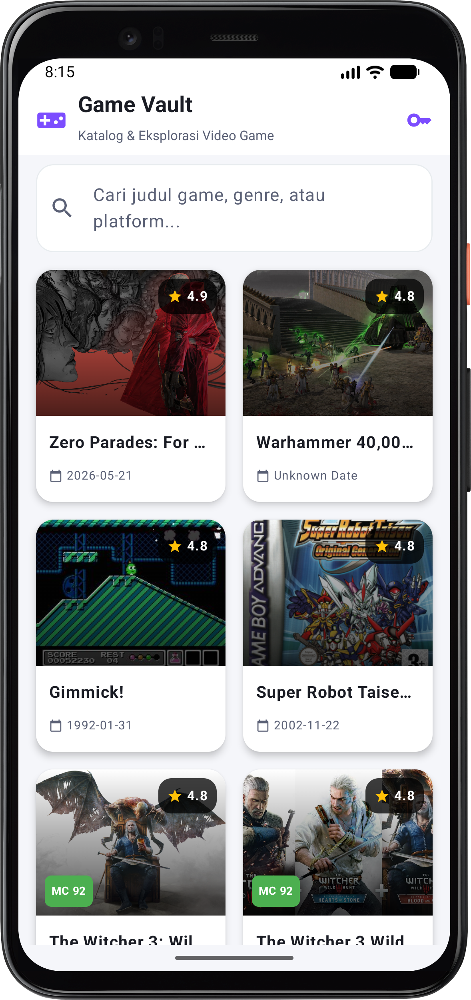
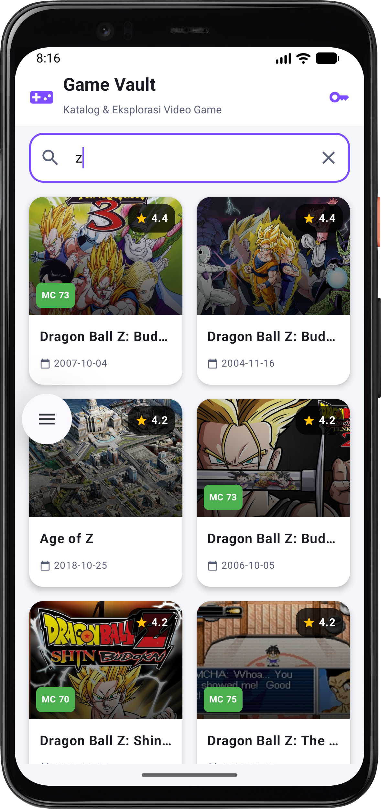
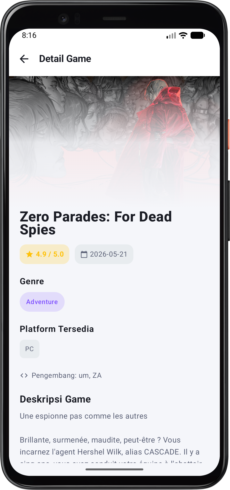

# Game Vault - Aplikasi Katalog dan Eksplorasi Video Game 🎮

Aplikasi mobile Android berbasis **Jetpack Compose** dan **Material Design 3** untuk mencari, mengeksplorasi, dan melihat informasi video game secara dinamis menggunakan REST API dari **RAWG**.

Dibuat untuk memenuhi seluruh spesifikasi pada modul:
**Responsi Mobile Programming - Aplikasi Katalog dan Eksplorasi Video Game**

---

## 📋 Daftar Isi
1. [Tangkapan Layar Aplikasi (Screenshots)](#-tangkapan-layar-aplikasi-screenshots)
2. [Fitur Utama](#-fitur-utama)
3. [Persyaratan Teknis & Arsitektur (MVVM)](#-persyaratan-teknis--arsitektur-mvvm)
4. [Teknologi & Library](#-teknologi--library)
5. [Struktur Proyek](#-struktur-proyek)
6. [Integrasi REST API (RAWG)](#-integrasi-rest-api-rawg)
7. [Penjelasan Antarmuka (Screens)](#-penjelasan-antarmuka-screens)
8. [Petunjuk Menjalankan Aplikasi](#-petunjuk-menjalankan-aplikasi)

---

## 📸 Tangkapan Layar Aplikasi (Screenshots)

Berikut adalah tangkapan layar langsung dari aplikasi saat dijalankan pada perangkat Android:

| 1. Home Screen (Katalog Game) | 2. Fitur Pencarian (Search Bar) | 3. Game Detail Screen |
|:---:|:---:|:---:|
|  |  |  |
| *Katalog Grid responsif dengan rating bintang, tanggal rilis ISO 8601, & skor Metacritic* | *Pencarian real-time dengan filter instan dan debouncing coroutine* | *Rincian lengkap game: hero banner, rating, genre, platform, developer, & deskripsi* |

---

## 🌟 Fitur Utama

- **Katalog Video Game (Home Screen)**:
  - Menampilkan kumpulan game dalam layout modern responsif menggunakan `LazyVerticalGrid`.
  - Dilengkapi thumbnail cover art beresolusi tinggi, judul game, badge rating angka bintang (contoh: `⭐ 4.9`), dan tanggal rilis format ISO 8601 (`YYYY-MM-DD`).
  - Badge Metacritic score (`MC 92`, `MC 73`, dll) untuk indikator kualitas game.
- **Pencarian Real-Time (Search Functionality)**:
  - Search bar interaktif dengan teknik debounce coroutine (400ms) untuk optimasi panggilan API tanpa lag.
  - Pencarian dinamis mendukung nama judul game, genre, maupun platform.
  - Dilengkapi tombol hapus (*Clear button*) cepat untuk mereset pencarian.
- **Halaman Detail Game (Game Detail Screen)**:
  - Hero image banner dinamis dengan efek transisi gradient fade yang halus ke latar belakang.
  - Informasi judul game lengkap, rating angka (misal `⭐ 4.9 / 5.0`), tanggal rilis format ISO 8601 (`📅 2026-05-21`), chip genre interaktif, label platform yang didukung, dan studio pengembang (*developer*).
  - Deskripsi lengkap game dengan pembersihan tag HTML otomatis (*clean description*).
  - Tombol navigasi kembali (*Back Navigation*) ke halaman utama.
- **State-Driven UI & Penanganan Recomposition**:
  - `UiState.Loading`: Animasi CircularProgressIndicator saat memuat data.
  - `UiState.Success`: Render daftar game atau tampilan detail.
  - `UiState.Error`: Tampilan error informatif dengan tombol *Coba Lagi* (*Retry*).
- **Konfigurasi Fleksibel API Key & Fallback Cerdas**:
  - Modal konfigurasi API Key langsung pada header aplikasi.
  - Mekanisme *Graceful Fallback* ke database lokal jika API key habis limit / offline / tidak disetel, menjamin aplikasi selalu dapat didemonstrasikan dengan lancar.

---

## 🏛 Persyaratan Teknis & Arsitektur (MVVM)

Aplikasi dibangun menggunakan pola arsitektur **MVVM (Model - View - ViewModel)** sesuai standar industri Android modern:

```
┌────────────────────────────────────────────────────────┐
│                   UI LAYER (View)                      │
│   HomeScreen, DetailScreen, GameCard, AppNavGraph      │
└───────────────────────────▲────────────────────────────┘
                            │ StateFlow / UiState
┌───────────────────────────┴────────────────────────────┐
│                  VIEWMODEL LAYER                       │
│             HomeViewModel, DetailViewModel             │
└───────────────────────────▲────────────────────────────┘
                            │ Coroutines / suspend
┌───────────────────────────┴────────────────────────────┐
│                  REPOSITORY LAYER                      │
│                   GameRepository                       │
└───────────────────────────▲────────────────────────────┘
                            │
              ┌─────────────┴─────────────┐
              ▼                           ▼
     [ RAWG REST API ]            [ Fallback Dataset ]
   (Retrofit & OkHttp)          (Curated Game Catalog)
```

1. **Model Layer (`data/model`)**:
   - `GameResponse.kt`: DTO untuk pemetaan JSON response list RAWG API.
   - `GameDetailResponse.kt`: DTO untuk detail game.
   - `GameItem.kt`: Domain model bersih yang memanfaatkan fitur Kotlin seperti `data class`, `null safety`, default parameters, dan computed properties.
2. **Network Layer (`data/api`)**:
   - `ApiService.kt`: Interface Retrofit mendefinisikan endpoint `@GET("games")` dan `@GET("games/{id}")`.
   - `ApiClient.kt`: Singleton Retrofit dengan OkHttp logging interceptor, timeout configuration, dan Gson converter.
3. **Repository Layer (`data/repository`)**:
   - `GameRepository.kt`: Mengelola abstraksi sumber data, menangani pemanggilan jaringan secara asynchronous menggunakan coroutines (`Dispatchers.IO`), serta menyediakan fallback data.
4. **ViewModel Layer (`ui/viewmodel`)**:
   - `HomeViewModel.kt`: Mengelola query pencarian, debounce flow, filter game, dan state UI (`UiState<List<GameItem>>`).
   - `DetailViewModel.kt`: Mengelola pemuatan detail game spesifik berdasarkan ID.
5. **View / UI Layer (`ui/screen`, `ui/navigation`, `ui/theme`)**:
   - Dibuat secara deklaratif penuh dengan Jetpack Compose & Material 3.

---

## 🛠 Teknologi & Library

- **Bahasa Pemrograman**: Kotlin 2.2+ (Data classes, Null Safety, Coroutine Flows, Extension functions, Lambdas).
- **UI Framework**: Android Jetpack Compose BOM 2026.02.01.
- **Design System**: Material Design 3 (`androidx.compose.material3`).
- **Networking**: Square Retrofit 2.11.0 + Gson Converter 2.11.0.
- **HTTP Client**: Square OkHttp 4.12.0 + Logging Interceptor.
- **Asynchronous**: Kotlin Coroutines & StateFlow.
- **Image Loading**: Coil Compose 2.7.0.
- **Navigasi**: Jetpack Navigation Compose 2.8.8.
- **Lifecycle & Architecture**: ViewModel Compose 2.8.7.

---

## 📁 Struktur Proyek

```
app/src/main/java/com/example/responsipraktikum/
├── MainActivity.kt                  # Entry point aplikasi & inisialisasi NavController
├── data/
│   ├── api/
│   │   ├── ApiClient.kt             # Singleton Retrofit & OkHttpClient
│   │   └── ApiService.kt            # Definisi endpoint REST API RAWG
│   ├── model/
│   │   ├── GameItem.kt              # Domain model video game untuk UI
│   │   ├── GameResponse.kt          # DTO Response daftar game
│   │   └── GameDetailResponse.kt    # DTO Response rincian game
│   └── repository/
│       └── GameRepository.kt        # Repository pengelola data API & fallback
└── ui/
    ├── navigation/
    │   ├── Screen.kt                # Sealed class rute navigasi (Home & Detail)
    │   └── NavGraph.kt              # Setup Compose NavHost
    ├── screen/
    │   ├── HomeScreen.kt            # Layar katalog: Search bar, Grid list, Rating badge
    │   └── DetailScreen.kt          # Layar detail: Hero image, Rating, Rilis, Deskripsi
    ├── state/
    │   └── UiState.kt               # Sealed interface state (Loading, Success, Error)
    ├── theme/
    │   ├── Color.kt                 # Cyber gaming color palette
    │   ├── Theme.kt                 # Material 3 theme configuration
    │   └── Type.kt                  # Typography
    └── viewmodel/
        ├── HomeViewModel.kt         # State holder & business logic katalog game
        └── DetailViewModel.kt       # State holder & business logic detail game
```

---

## 🌐 Integrasi REST API (RAWG)

- **Base URL**: `https://api.rawg.io/api/`
- **Endpoints yang digunakan**:
  1. `GET /api/games?key={API_KEY}&search={query}&ordering=-rating`
     - Mengambil daftar video game terpopuler atau hasil pencarian.
  2. `GET /api/games/{id}?key={API_KEY}`
     - Mengambil rincian lengkap spesifik suatu video game.
- **Data yang ditampilkan**:
  1. Nama game (`name`)
  2. Rating dalam angka (`rating`, misal: `4.9` atau `4.8`)
  3. Tanggal rilis format ISO 8601 (`released`, contoh: `YYYY-MM-DD` / `2026-05-21`)
  4. Deskripsi game (`description` / `description_raw`)
  5. Fitur tambahan: Gambar sampul (`background_image`), Skor Metacritic (`metacritic`), Daftar Genre (`genres`), Daftar Platform (`platforms`), dan Pengembang (`developers`).

---

## 📱 Penjelasan Antarmuka (Screens)

### 1. Home Screen (`HomeScreen.kt`)
- **Top App Bar**: Menampilkan judul aplikasi (*Game Vault*), subjudul (*Katalog & Eksplorasi Video Game*), ikon kontroler game, serta tombol ikon kunci (*Key Icon*) untuk memasukkan atau memperbarui RAWG API Key kapan saja.
- **Search Bar**: Kolom teks pencarian dinamis dengan ikon kaca pembesar (*Search*) dan tombol silang (*Clear*) untuk membersihkan input teks dalam satu kali klik.
- **Grid Layout (`LazyVerticalGrid`)**: Menyusun kartu-kartu game dalam 2 kolom grid yang adaptif terhadap ukuran layar.
- **Komponen Kartu (`GameCard`)**:
  - Gambar sampul game dimuat asinkron via Coil dengan efek sudut membulat (*Rounded Corner*).
  - Badge rating angka bintang di pojok kanan atas kartu (contoh: `⭐ 4.9`).
  - Badge skor Metacritic warna hijau di pojok kiri bawah gambar jika tersedia (`MC 92`, `MC 73`).
  - Judul game teks tebal dengan limit satu baris dan elipsis.
  - Tanggal rilis format ISO 8601 dengan ikon kalender (`📅 2026-05-21`).

### 2. Fitur Pencarian Real-Time (`HomeScreen.kt`)
- Menghubungkan input teks pengguna langsung ke `HomeViewModel.searchQuery`.
- Menggunakan operator Coroutine Flow `debounce(400)` dan `distinctUntilChanged()` agar pemanggilan REST API hanya terjadi setelah jeda ketik 400ms, menghemat kuota request API dan menjaga performa recomposition tetap ringan.
- Hasil pencarian menampilkan game yang relevan secara instan (contoh pada tangkapan layar saat mengetik huruf `z`, muncul kumpulan seri *Dragon Ball Z*, *Age of Z*, dsb).

### 3. Game Detail Screen (`DetailScreen.kt`)
- **Top App Bar**: Judul "Detail Game" dengan tombol panah navigasi kembali (*Back Button*) ke Home Screen.
- **Hero Image Banner**: Gambar sampul beresolusi tinggi dengan gradasi vertikal halus (*gradient overlay*) menyatu dengan warna tema.
- **Judul Game**: Tipografi ekstra tebal (*Extra Bold*) ukuran 26sp.
- **Metadata Badges**:
  - Rating angka emas terformat `⭐ 4.9 / 5.0`.
  - Tanggal rilis format ISO 8601 `📅 2026-05-21`.
  - Chip skor Metacritic warna hijau.
- **Kategori & Platform**:
  - Flow chips untuk **Genre** (contoh: *Adventure*, *Action*, *RPG*).
  - Flow chips untuk **Platform Tersedia** (contoh: *PC*, *PlayStation*, *Xbox*).
  - Label studio **Pengembang** (*Developer*).
- **Deskripsi Game**: Menampilkan teks narasi dan sinopsis game lengkap yang telah dibersihkan dari tag HTML (*clean description*).

---

## 🚀 Petunjuk Menjalankan Aplikasi

1. **Buka Proyek di Android Studio**:
   - Buka Android Studio, pilih **Open** dan arahkan ke direktori proyek ini.
2. **Sinkronisasi Gradle**:
   - Klik **Sync Project with Gradle Files** (ikon gajah).
3. **Konfigurasi API Key**:
   - API Key resmi telah terpasang di `ApiClient.kt`.
   - Atau bisa diganti langsung melalui tombol ikon kunci di pojok kanan atas aplikasi.
4. **Jalankan Aplikasi**:
   - Pilih emulator atau perangkat fisik Android (Min SDK: 29 / Android 10+).
   - Klik tombol **Run 'app'** (Shift + F10).
